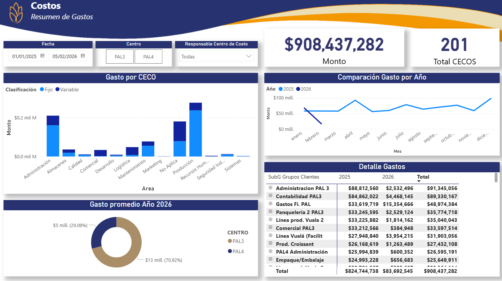

#  📊 Dashboard Gastos Panovo - Power BI 

Documentación técnica de la herramienta Gastos Panovo

--- 

##  📌 Objetivo 

El objetivo principal del tablero de Gastos Panovo es monitorear, controlar y analizar los egresos de la organización, asegurando disciplina presupuestal, visibilidad oportuna del gasto y toma de decisiones basada en datos confiables.

--- 

##  🛠️ Tecnologías Utilizadas 
- Power BI Desktop (Import)
- SAP / Excel
- GitHub (para control de versiones y documentación técnica)

 --- 
##  📁Estructura del Repositorio 

```plaintext
GastosPanovo/
├── pbix/                                   → Archivo PBIX del tablero
├── README.md                               → Descripción general del repositorio
├── docs/
│   ├── Medidas.md                          → Medidas DAX documentadas
│   └── video_tutorial.md                   → Guía de uso del dashboard
├── img/
│   ├── preview_dashboard.png               → Captura del dashboard
│   └── modelo_datos.png                    → Relación entre tablas

```

--- 
##  Preview del Dashboard 

